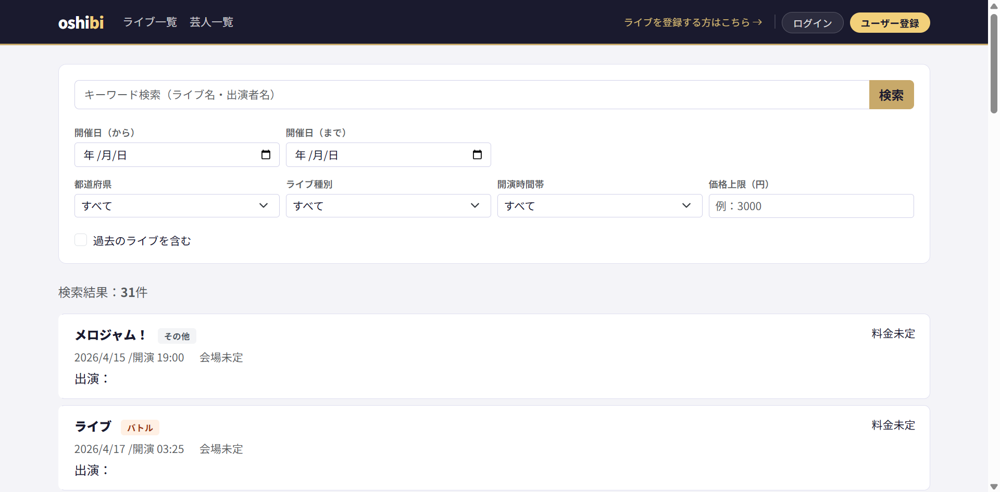
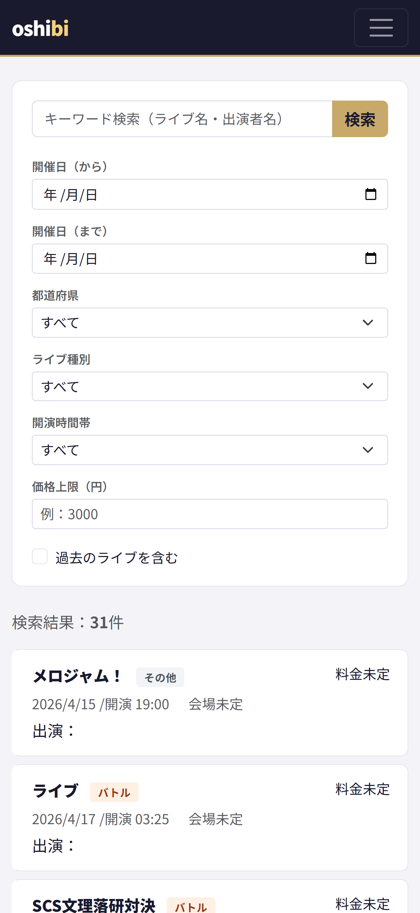
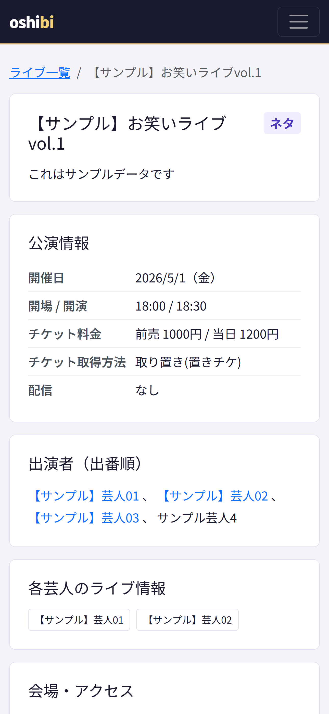
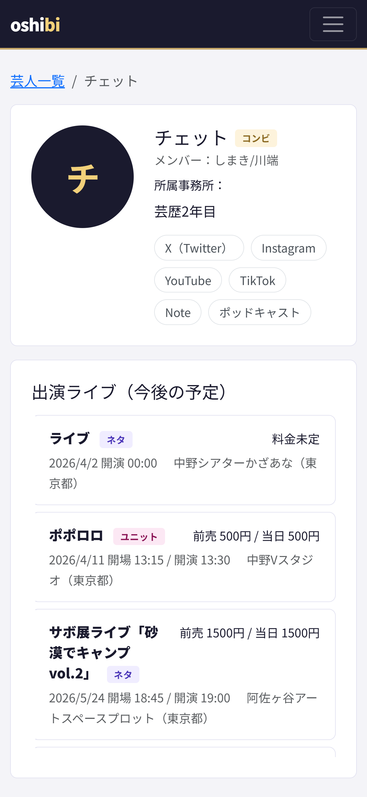
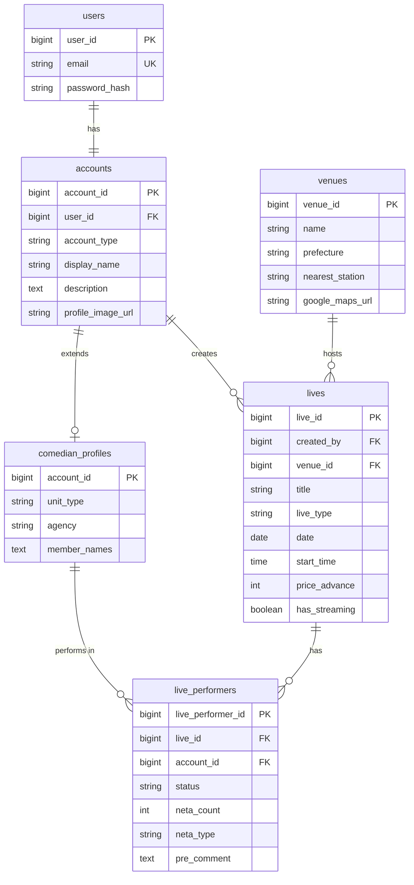
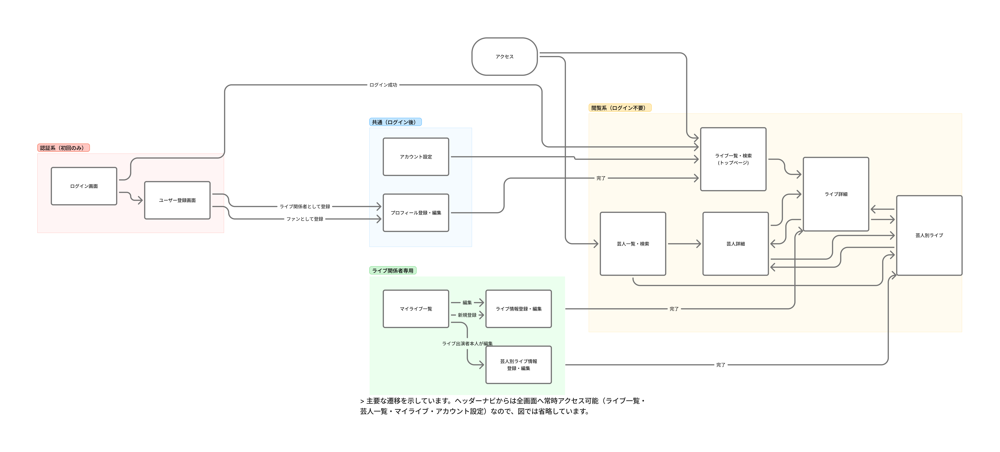

# oshibi

> **「芸人は推されやすく、ファンは推しやすく」**
>
> お笑い芸人とファンのための、ライブスケジュール管理プラットフォーム。

[](https://openjdk.org/projects/jdk/17/)
[](https://spring.io/projects/spring-boot)
[](https://www.postgresql.org/)
[](https://getbootstrap.com/)
[](https://render.com/)
[](https://opensource.org/licenses/MIT)

### https://oshibi.onrender.com



| ライブ一覧 | ライブ詳細 | 芸人別ライブページ |
| :---: | :---: | :---: |
|  |  |  |

---

## 概要

| 項目 | 内容 |
| --- | --- |
| **開発体制** | 個人開発 |
| **開発期間** | 約2ヶ月（2026年2月〜4月） |
| **画面数** | 全12画面 |
| **テーブル数** | 7テーブル |
| **コード行数** | Java 約2,100行 / Thymeleaf 約2,200行 / CSS 約290行（計約4,550行） |
| **デプロイ** | Render.com（Docker / マルチステージビルド） |

---

## 目次

- [なぜ作ったのか](#なぜ作ったのか)
- [主な機能](#主な機能)
- [デモ用アカウント](#デモ用アカウント)
- [技術的なこだわり](#技術的なこだわり)
- [技術スタック](#技術スタック)
- [ER図](#er図)
- [画面一覧](#画面一覧全12画面)
- [画面遷移図](#画面遷移図)
- [ローカル開発環境のセットアップ](#ローカル開発環境のセットアップ)
- [今後の開発予定](#今後の開発予定)
- [作者](#作者)

---

## なぜ作ったのか

お笑い芸人として活動する中で、**ライブ情報が X・Instagram・Note などに散らばっていて、ファンが追いきれない**という課題を日常的に感じていました。

既存サービス（Hashigo 等）は「ライブ情報のデータベース」ですが、oshibi は **「芸人が主役」** のアプリです。

同じライブでも芸人ごとに違う情報が見える——芸人 A にとっては「新ネタ 3 本おろすライブ」、芸人 B にとっては「大好きな先輩との共演ライブ」。この **ライブ情報の 2 層構造**（共通ライブ情報 ＋ 芸人別ライブ情報）が oshibi の核です。

---

## 主な機能

### 閲覧（ログイン不要）

- **ライブ一覧・検索** — キーワード・日付・都道府県・ライブ種別・価格帯・時間帯で絞り込み
- **ライブ詳細** — 公演情報・出演者・会場情報を一画面で確認
- **芸人一覧・検索** — 芸名・活動カテゴリ・事務所で検索
- **芸人詳細** — プロフィール・SNS リンク・出演ライブ一覧
- **芸人別ライブページ** — その芸人にとってのそのライブの情報（本予定/仮予定・ネタ情報・コメント）

### 登録・編集（要ログイン）

- **ユーザー登録** — ファン / ライブ関係者の 2 種類のアカウント
- **ライブ情報の CRUD** — ライブ関係者が共通情報を登録・編集・削除
- - **フライヤー画像からの AI 自動入力** — Claude Sonnet 4.6 の Vision API でフライヤーを解析し、ライブ名・日時・会場・料金・出演者をフォームに自動入力
- **会場のインライン新規登録** — ライブ登録フォーム内で既存会場から選択 or その場で新規登録を切り替え（画面遷移なし）
- **出演者登録** — 芸人を非同期検索して出演者として追加（出番順の並べ替え対応）
- **芸人別ライブ情報の編集** — 出演者本人のみが本予定/仮予定・ネタ情報・コメントを編集
- **プロフィール編集・アカウント設定**

---

## デモ用アカウント

> 登録不要でログインしてお試しいただけます。

| 種別 | メールアドレス | パスワード |
| --- | --- | --- |
| ライブ関係者（芸人） | `demo-comedian@example.com` | `demo1234` |
| ファン | `demo-fan@example.com` | `demo1234` |

---

## 技術的なこだわり

oshibi で特に意識して設計した6点です。面接でもよく質問される箇所をピックアップしました。

### 1. ライブ情報の2層構造

```
lives（共通ライブ情報：ライブ名・日時・会場・料金）
  └── live_performers（芸人別ライブ情報）
        ├── 本予定 / 仮予定ステータス
        ├── ネタ本数・ネタ種類
        └── ファンへのコメント
```

`live_performers` を単なる中間テーブルではなく、**「その芸人にとってのこのライブ」というドメイン概念**として設計。これにより、同じライブが芸人ごとに違う見え方になります。

### 2. フライヤー画像からのライブ情報自動抽出（Vision API 統合）

oshibi の最大の課題は **「登録ハードルの高さ」** でした。1ライブの登録に3〜5分かかり、月20本ライブに出る芸人にとって明確なフリクションになる。「情報が集まらなければサービスが成立しない」という鶏卵問題に対し、**入力作業そのものを AI に肩代わりさせる** ことで解決しました。

**技術選定（Claude vs Gemini）:**

15ライブ・24枚のフライヤーで A/B 検証。両モデルとも抽出精度はほぼ互角でしたが、**ミスの質** に決定的な差がありました。

| 観点 | Gemini | Claude Sonnet 4.6 |
| --- | --- | --- |
| 精度 | 互角 | 互角 |
| 自信のない項目の扱い | **それっぽく補正** | **`null` で返す** |
| 致命的な失敗例 | 存在しない芸人名を生成、日付を微妙に補正 | 該当なし |

フォーム自動入力というユースケースでは、**「間違えるくらいなら空欄」** という振る舞いが Human-in-the-Loop と相性が良く、Claude を採用しました。

**Human-in-the-Loop 設計:**

AI の出力は必ず **下書き** として扱い、ユーザーの確認・修正を経て保存されます。出演者の芸人マスタとの紐付けも自動化せず、ユーザーが手動で検索し直す方式にしています。AI の推測より人間の確認を優先する設計です。

**実装の工夫:**

- **プロンプトの外出し** — `src/main/resources/prompts/extract-live-info.txt` に分離。チューニング時に Java コードを触らずに済む
- **会場の自動入力** — `venueSearch` の input 要素に値を代入し `dispatchEvent(new Event('input'))` で既存の検索ドロップダウンを自動発火。既存フローに干渉しない設計
- **外部依存の最小化** — HTTP クライアントは Java 標準の `HttpClient` を使用。追加ライブラリなし
- **環境変数管理** — API キーは `${ANTHROPIC_API_KEY}` で環境変数から注入。ローカル/本番で同じコード

### 3. アカウント継承を「識別関係」で表現

`accounts` を基底テーブル、`comedian_profiles` をそのサブクラス（LIVE_STAFFのみが持つ拡張属性）として設計しました。ポイントは **`comedian_profiles` のPKを独立カラムにせず、`accounts.account_id` をそのままPK兼FKにしている**ことです（識別関係 / Identifying Relationship）。

これにより以下がスキーマレベルで保証されます:

- 芸人プロフィールはアカウントと**必ず1:1**で紐付く（UNIQUE制約を別途書かなくていい）
- **孤児レコードが物理的に作れない**（accountsを消さずにcomedian_profilesだけ作ることが不可能）
- **JOINが速い**（PK同士の結合になる）

FANとLIVE_STAFFで共通の属性（表示名・SNSリンク等）は `accounts` に、芸人特有の属性（ユニット種別・事務所等）だけを `comedian_profiles` に切り出しています。

### 4. 認可の2層設計

Spring Security の URL ベース認可だけでは「ライブ関係者なら誰でも他人のライブを編集できてしまう」状態になります。これを防ぐため、認可を2層に分けました。

| レイヤー | 担当 | 例 |
| --- | --- | --- |
| **SecurityConfig（ロール）** | 「誰がこのURLにアクセスできるか」 | `/lives/new` は LIVE_STAFF のみ |
| **Service層（本人確認）** | 「自分のリソースしか触れない」 | ライブ編集は登録者本人のみ、芸人別情報は出演者本人のみ |

### 5. Specification パターンによる動的検索

ライブ一覧は **キーワード・日付・都道府県・種別・価格帯・時間帯** の複合検索を持ちます。条件の組み合わせが多く、`findByXxxAndYyyAnd...` を全て書くと爆発するため、**JPA Specification パターン**で動的にクエリを構築しました。

### 6. @EntityGraph による N+1 問題の解消

ライブ一覧で出演者情報を表示するため、`@EntityGraph` で `live_performers` を JOIN FETCH。N+1 問題を一発で回避しています。

### 7. 出演者登録の非同期検索

ライブ登録画面の芸人追加は、`@RestController` + fetch API による非同期通信で実装。**画面遷移なしで芸人を検索・追加**できます。SSR 主体のアプリでも、必要な箇所だけ Ajax にすることで体験を損なわない構成にしました。

---

## 技術スタック

| レイヤー | 技術 | 選定理由 |
| --- | --- | --- |
| 言語 | Java 17 | C# 経験を活かせる＋ Web 系企業の求人で広く求められる |
| FW | Spring Boot 3 | Java のデファクトスタンダード。フルスタック開発力を示せる |
| テンプレート | Thymeleaf（SSR） | MVP の主要機能（検索・閲覧・登録）に SPA は不要。将来の React 移行を見据えてサービス層の責務分離を意識 |
| CSS | Bootstrap 5 | レスポンシブ対応。スマホ中心の利用を想定 |
| DB | PostgreSQL | Render.com ネイティブ対応。JPA 経由のため Java コードへの影響なし |
| ORM | Spring Data JPA / Hibernate | Repository インターフェースの自動実装で開発速度を確保 |
| 認証・認可 | Spring Security | BCrypt ハッシュ化・ロールベースアクセス制御・CSRF 対策 |
| マイグレーション | Flyway | バージョン管理された DB スキーマ管理（C# の EF Migrations と同じ発想） |
| テスト | JUnit 5 / Mockito | サービス層のユニットテスト |
| CI/CD | GitHub Actions | PR ごとにビルド・テスト自動実行 |
| AI 連携 | Anthropic Claude Sonnet 4.6 Vision API | フライヤー画像からのライブ情報自動抽出。Gemini との A/B 検証を経て採用 |
| デプロイ | Render.com（Docker） | マルチステージビルドで軽量イメージ化 |

---

## ER図
 

 
**補足:**
 
- `accounts.account_type` は `FAN` / `LIVE_STAFF` の2値。LIVE_STAFF のときのみ `comedian_profiles` に拡張属性を持ちます
- `comedian_profiles.unit_type` は `PIN` / `COMBI` / `TRIO` / `GROUP` / `STAFF` の5値
- `live_performers.status` は `CONFIRMED`（本予定） / `TENTATIVE`（仮予定）の2値
- **`comedian_profiles` のPKは独立カラムではなく `accounts.account_id` そのもの**（識別関係 / Identifying Relationship）。これにより、芸人プロフィールはアカウントと1:1で必ず紐付き、孤児レコードが物理的に作れない構造になっています。詳細は[技術的なこだわり](#技術的なこだわり)を参照。
 
---

## 画面一覧（全12画面）

| # | 画面 | アクセス権 |
| --- | --- | --- |
| 1 | ライブ一覧・検索（トップ） | 全員 |
| 2 | ライブ詳細 | 全員 |
| 3 | 芸人一覧・検索 | 全員 |
| 4 | 芸人詳細 | 全員 |
| 5 | 芸人別ライブページ | 全員 |
| 6 | ログイン | 全員 |
| 7 | ユーザー登録 | 全員 |
| 8 | プロフィール登録・編集 | ログイン後全員 |
| 9 | マイライブ一覧 | ライブ関係者のみ |
| 10 | ライブ情報登録・編集 | ライブ関係者のみ |
| 11 | 芸人別ライブ情報編集 | 出演者本人のみ |
| 12 | アカウント設定 | ログイン後全員 |

---

## 画面遷移図



画面の役割ごとに **閲覧系 / 認証系 / ライブ関係者専用 / 共通** の4つにグルーピングしています。閲覧系はログイン不要で、関係者専用はロール＋本人確認の2層認可で保護されています。ヘッダーナビからは全画面へ常時アクセス可能（ライブ一覧・芸人一覧・マイライブ・アカウント設定）なので、図では主要フローのみを記載しています。

> 原本は FigJam で作成しました。

---

## ローカル開発環境のセットアップ

### 前提条件

- Java 17
- PostgreSQL
- Gradle

### 手順

```bash
# 1. リポジトリをクローン
git clone https://github.com/daichi-shimakura/oshibi.git
cd oshibi

# 2. PostgreSQL にデータベースを作成
createdb oshibi

# 3. application.properties の DB 接続情報を環境に合わせて編集

# 4. アプリケーションを起動（Flyway が自動でテーブルを作成します）
./gradlew bootRun

# 5. ブラウザでアクセス
# http://localhost:8080
```

---

## 今後の開発予定
 
### 優先的に実装
 
- [ ] **Maps Embed API によるライブ会場の地図表示** — ライブ詳細に Google Maps を埋め込み。外部API連携の実装経験として
- [ ] **チケット URL の追加** — ライブ詳細からチケット予約サイトへ遷移
- [ ] **月間予定の画像生成** — 芸人が自分の月間予定をワンクリックで画像化→ SNS シェア用。html2canvas で実装
 
### 中長期ロードマップ

- [ ] **タグ機能＋複合検索条件の拡張** — `tags` / `live_tags` テーブル新設。「大学お笑い」「女芸人限定」「無料」等の属性タグで絞り込み。既存の Specification にタグ条件を追加
- [ ] **検索結果カレンダー表示** — ライブ一覧にリスト／カレンダー切り替えボタンを追加。FullCalendar.js（CDN）で実装。タグで絞る→カレンダーで見る、の体験を提供
- [ ] **フライヤー画像表示** — 芸人・ライブの画像を URL 登録で表示
- [ ] 推し芸人フォロー＋フォロー中芸人のライブ一覧
- [ ] フロントエンドの React 移行（REST API 化 → サービス層以下はそのまま流用）
- [ ] PWA または React Native によるモバイルアプリ化

---

## 作者

**島倉大地（Daichi Shimakura）**

エンジニア × お笑い芸人のデュアルキャリアを目指して活動中。
キングオブコント 2025 準々決勝進出。

- GitHub: [@daichi-shimakura](https://github.com/daichi-shimakura)
- X: [@daininge](https://x.com/daininge)
- LinkedIn: [Daichi Shimakura](https://www.linkedin.com/in/daichi-shimakura-127610401/)

---

## ライセンス

MIT License
